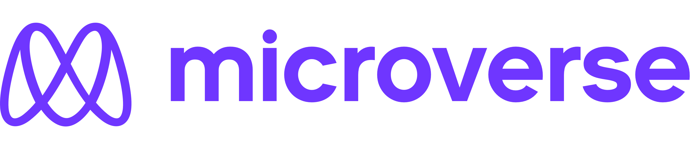

<h1 align="left">
Hi there! 👋 I'm Mavericks 
</h1>

```
🌱 A self-taught software developer from the Philippines.

👨‍💻 I spend most of my time learning to code by watching tutorials and reading materials about React, Sass,
and JavaScript. I started my coding journey in March 2022. Currently, I am studying as a remote student
at Microverse.

🎓 I graduated from the University of the Philippines - Diliman with a degree in 🏗 BS Civil Engineering.

💻 My most used line of code is git commit -m "Create .gitignore file".

🥅 My main goal after completing the program is to be able to secure a full stack web developer job position,
as well as collaborate and contribute to open source projects, and assist other students in Microverse
as a volunteer mentor.

```
---
<table align="center">
  <tr>
    <td>
  <h2 align="center">
  📬 You can reach me at :

  [](https://github.com/mavericks-db)
  [](https://twitter.com/mavericks_db)
  [](https://www.facebook.com/mavericksdb/)
  [](https://www.linkedin.com/in/mavericks-db/)
  [](mailto:balitaanmavericks@gmail.com)
  </h2>

  <h2 align="center">
🛠️ Languages and Tools :

<table align="center">
    <tr>
      <td align="center"></td>
      <td align="center"></td>
      <td align="center"></td>
    </tr>
    <tr>
        <td align="center"></td>
        <td align="center"></td>
        <td align="center"></td>
    </tr>
    <tr>
        <td align="center"></td>
        <td align="center"></td>
        <td align="center">
        </td>
    </tr>
    <tr>
      <td align="center"></td>
      <td align="center"></td>
      <td align="center"></td>
    </tr>
    <tr>
      <td align="center"></td>
      <td align="center"></td>
      <td align="center"></td>
    </tr>
    <tr>
      <td align="center"></td>
      <td align="center"></td>
      <td align="center"></td>
    </tr>
</table>
</h2>
      </td>
      <td>
      
      </td>
    </tr>
</table>

<!--

 -->

<h2 align ="center">⚡ My Stats :
<div >
  
  
</div>


<!-- <h2>Weekly Coding Stats</h2>

 -->

<div align="center">

[](https://github.com/mavericks-db) [](https://github.com/mavericks-db?tab=repositories) [](https://github.com/mavericks-db)

<a href = "https://commits.top/philippines.html" target="_blank">
	
</a>

[](https://wakatime.com/@c2d0d9f8-89e4-48a4-8894-5b95c521ce07)


<!-- [](https://github.com/mavericks-db) -->
</div>


---
<details>
  <summary align='center'><a href="https://www.microverse.org/"></a></summary>
<table align="center">
  <tr>
    <td align="center"><a href="https://www.credential.net/c7621860-3a5c-4502-ab70-45d58ba77e44#gs.yxrk1w" target="blank"></a></td>
    <td align="center"><a href="https://www.credential.net/b7dec4e6-1754-4eff-a6ab-076497cdef6a#gs.1ks4o0" target="blank"></a></td>
  </tr>
</table>
</details>

---
Current Projects

<a href="https://github.com/mavericks-db/portfolio">
  
</a>
<a href="https://github.com/mavericks-db/capstone01">
  
</a>
<a href="https://github.com/mavericks-db/awesome-books-ES6">
  
</a>
<a href="https://github.com/mavericks-db/todo-list">
  
</a>
<a href="https://github.com/mavericks-db/leaderboard">
  
</a>
<a href="https://github.com/mavericks-db/capstone02">
  
</a>
<a href="https://github.com/mavericks-db/math-magicians">
  
</a>
<a href="https://github.com/mavericks-db/bookstore">
  
</a>


<em>Let's connect and forge the future together 🚀 <em>

<!-- https://github.com/anuraghazra/github-readme-stats -->
